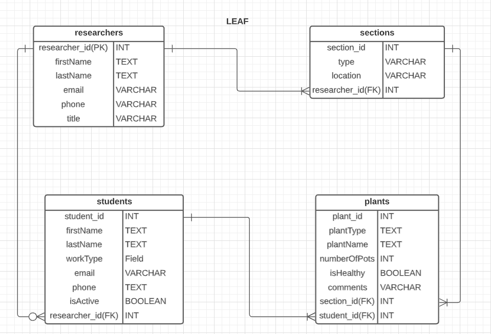
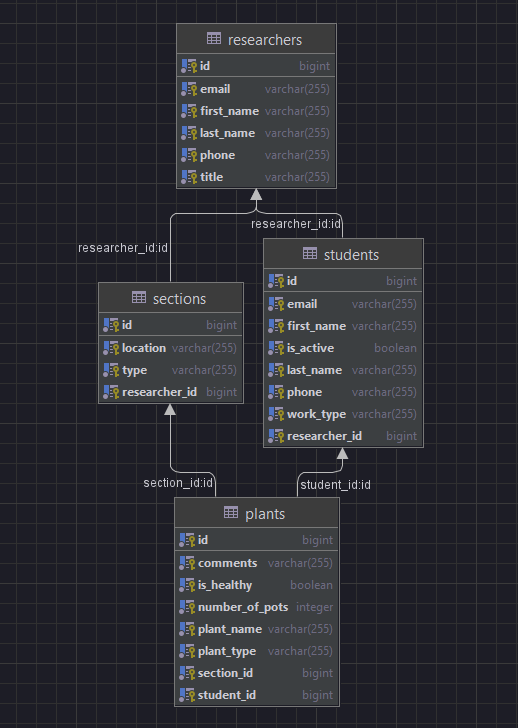
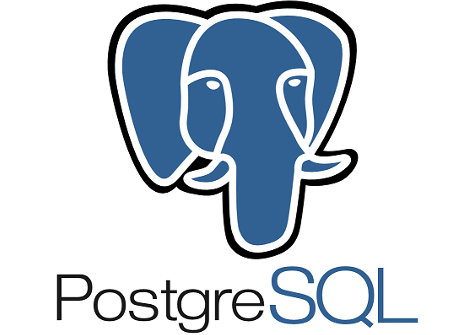
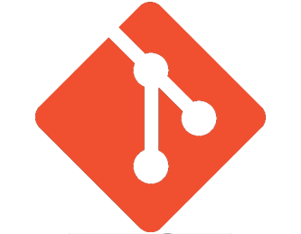

# LEAF Database/ERD SEI PROJECT 2

## INTRO

LEAF stands for Lake Environmental Aquatic Facility. It is a database created for individual research facilites. This idea came about from a previous work experience I had working as a research assistant for a team of reasearchers. 

For this project there are four models: researchers, students, sections, and plants.
- __researchers model__: information on a researcher is stored including unique researcher_id, name, email, phone, and title.
- __students model__: information on student including unique student_id, name, workType (contract, etc), phone, isActive, researcher_id (primary researcher the student works with).
- __sections model__: information on they location (on the facility) and type (greenhouse, pond, outdoor, etc).
- **plants model**: Information on the plants in a specific section such as, plantType (terrestrial or aquatic), name, number of pots, isHealthy, comments, section_id, student_id.

## USER STORIES
| | 
|:---|
|1.	As a user, I would like to view all sections that belong to a researcher.
|2.	As a user, I would like to view all plants that are in a section.
|3.	As a user, I would like to view what students are responsible for which plants.
|4.	As a user, I would like to view which student works under which researcher.
|5.	As a user, I would like to view which sections belong to a researcher.
|6.	As a user, I would like to delete records in my database for the student, researcher, plant, and section entities.
|7.	As a user, I would like to create a record in my database for the student, researcher, plant, and section entities.
|8. As a user, I would like to update my database for the student, researcher, plant, and section.

## ENTITY RELATIONSHIP DIAGRAMA (ERD):

## ENDPOINTS

| Request Type | Enpoint | Functionality |
|--|--|--|
|RESEARCHERS TABLE|
| 1. POST | /api/researcher/ | create a new researcher |
|2. GET | /api/researchers/ | get ALL researchers |
|3. GET | /api/researcher/{researcherId}/ | get one researcher |
|4. PUT | /api/researcher/{researcherId}/ | update one researcher |
|5. DELETE | /api/researcher/{researcherId}/ | delete one researcher |
|SECTIONS TABLE|
|6. POST | /api/researcher/{researcherId}/section/ | delete one researcher |
|7. GET | /api/sections/ | get all sections |
|8. GET | /api/researcher/{researcherId}/sections/ | get all sections that belong to one researcher |
|9. DELETE | /api/researcher/{researcherId}/section/{sectionId}/ | delete a section |
|STUDENTS TABLE|
|10. GET |/api/students/ | get ALL students |
|11. GET | /api/researcher/{researcherId}/students/ | get students that belong to a researcher |
|12. POST | /api/researcher/{researcherId}/student/ | create a student for a researcher |
|13. PUT | /api/researcher/{researcherId}/student/{studentId}/ | update student |
|14. DELETE | /api/researcher/{researcherId}/student/{studentId}/ | delete a student |
| PLANTS TABLE |
|15. GET |/api/plants/ | get ALL plants |
|16. GET | /api/researcher/{researcherId}/section/{sectionId}/plant/ | get plants that are in a section |
|17. POST | /api/researcher/{researcherId}/section/{sectionId}/plant/ | create a plant in a section |
|18. PUT | /api/researcher/{researcherId}/section/{sectionId}/plant/{plantId}/ | update a plant |
|19. DELETE | /api/researcher/{researcherId}/section/{sectionId}/plant/{plantId}/ | delete a plant |
| PLANTS AND STUDENT TABLE |
|20. PUT | /api/plant/{plantId}/student/{studentId}/ | adding a studentId to the plantId |

## TOOLS AND TECHNOLOGIES USED
POSTMAN, JAVA ULTIMATE, POSTGRES DATABASE, GIT, JAVA SPRING BOOT, lucidCharo for erd diagram

|Name      |           | Purpose     |
| -------- | -------------- |--------------|
| Postman |  | Build API Requests
| Intellij Idea Ultimate |  | Code Editor for Java Spring Boot Project
| PostgreSQL Database |  | Database Mangement system
| GIT | | Version Control System
| Java Spring Boot | | Develop the project's web application using Spring Frameworks
| Lucidchart |  | Create the Entity Relationship Diagram

## CHALLENGES
- One challenge that I faced was my plants table that had 2 foregin keys. The 2 foregin keys where student_id and section_id. The plants model has two Many to One entity relationship with the students and sections models. A student can have many plants that they are in charge of maintaing and a section has many types of plants. The issue came about after creating a plant record (row) the student_id was null. So, to change the null value and assign it an existing student_id number, I created a method in the PlantService called putStudentPlant where I retrieved both ids (plant and student) and then used setStudent() and added the studentId using get() method. Thus, I was able to change the null value to a student_id number.

## FUTURE CONSIDERATIONS
- Since this database can only be used at the local level e.g(one research plant facility) this can be changed to be used with individual researchers who want to manage their research profiles. So, change this to an application that uses JSON Web Tokens in Spring Security to power user authentication. In other words, a researcher can create a profile with email and password and login and navagite the API endpoints.

